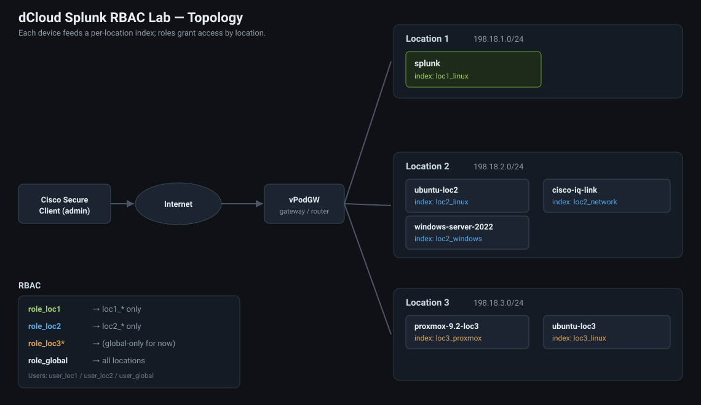

# splunk-dcloud

GitHub-driven, self-rebuilding **Splunk RBAC lab** for Cisco **dCloud**. The
dCloud VM resets to an empty template each session, so on every startup one
command pulls this repo and rebuilds the entire Splunk configuration from
scratch — per-location indexes, RBAC roles, users, and dashboards. Nothing is
configured by hand; the lab is identical every time.

To change the lab, edit files here and `git push` to `main` — the next session
picks it up automatically. The dCloud startup command never changes.



---

## How it works

```
dCloud Startup Automation (session.xml)
        │  one command  (fixes DNS, ensures git, clones -b main)
        ▼
   apply.sh          idempotent orchestrator
        ├── deploys the dcloud_lab app (indexes + dashboards + static assets)
        ├── starts/restarts Splunk (via systemd) so indexes take effect
        ├── creates RBAC roles at runtime via REST
        ├── creates users via the Splunk CLI (mapped to roles)
        └── [later] data inputs (HEC / forwarder inputs for Ubuntu + Proxmox)
```

`bootstrap.sh` is an alternative entry point that clones/refreshes an existing
checkout and hands off to `apply.sh`; the canonical startup command below runs
`apply.sh` directly.

## Startup (each session)

Everything resets each session. Run these in order.

**1. Splunk box** — build the whole Splunk config (indexes, roles, users,
dashboards, SSH router polling):

```bash
sudo rm -rf /opt/dcloud-splunk && sudo git clone -b main https://github.com/js-csco/splunk-dcloud.git /opt/dcloud-splunk && sudo bash /opt/dcloud-splunk/apply.sh
```

**2. ubuntu-london** — forward logs (syslog → `london_linux`):

```bash
curl -fsSL https://raw.githubusercontent.com/js-csco/splunk-dcloud/main/ubuntu/forward-to-splunk.sh | sudo bash -s -- london
```

**3. ubuntu-berlin** — forward logs, then install the Universal Forwarder
(pulls the local Proxmox API → `berlin_proxmox`):

```bash
curl -fsSL https://raw.githubusercontent.com/js-csco/splunk-dcloud/main/ubuntu/forward-to-splunk.sh | sudo bash -s -- berlin
curl -fsSL https://raw.githubusercontent.com/js-csco/splunk-dcloud/main/ubuntu/install-uf.sh   | sudo bash
```

**4. (optional) demo data** — correlated events on the Ubuntu boxes:

```bash
curl -fsSL https://raw.githubusercontent.com/js-csco/splunk-dcloud/main/ubuntu/generate-activity.sh | bash
```

Then open `http://198.18.1.124:8000` → **Lab Overview → Setup Status** (all
green) and log in as `leo` / `ben` / `gary` (password `C1sco12345`).

> The Cisco routers (London/Berlin) are polled automatically by the Splunk box —
> nothing to run there.

### Troubleshooting: DNS

If a box can't resolve `github.com` (`ping 1.1.1.1` works but `ping google.com`
fails), fix the resolver, then re-run:

```bash
sudo rm -f /etc/resolv.conf
printf 'nameserver 1.1.1.1\nnameserver 8.8.8.8\noptions timeout:2 attempts:2\n' | sudo tee /etc/resolv.conf
```

> Always clone with `-b main` (a plain `git clone` may pull an older default branch).

## Location-based RBAC (the core design)

Access control is enforced at the **index** level. The golden rule: an index
belongs to exactly ONE location, so a role granting one location's indexes can
never leak another's. Indexes are named `loc<N>_<datatype>` so a role grants a
whole location with a single wildcard.

| Location | Network | Devices | Indexes | Roles with access |
|---|---|---|---|---|
| loc1 | 198.18.1.0/24 | splunk (infrastructure) | `loc1_linux` | `role_global` only |
| London (loc2) | 198.18.2.0/24 | ubuntu-london, windows-server-2022-london | `london_linux`, `london_windows`, `london_network` | `role_london`, `role_global` |
| Berlin (loc3) | 198.18.3.0/24 | proxmox-9.2-berlin, ubuntu-berlin | `berlin_linux`, `berlin_proxmox` | `role_berlin`, `role_global` |

> Location 1 is the Splunk server itself (infrastructure), so it has **no
> dedicated analyst** — `loc1_linux` is visible to `role_global` only.

**Roles** (created at runtime via REST in `apply.sh`): `role_london → london_*`,
`role_berlin → berlin_*`, `role_global → london_*;berlin_*;loc1_*` (+ `_*` for
internal). REST is used instead of `authorize.conf` because on this
image app-level `authorize.conf` roles did not register even after a restart,
whereas REST creation is immediate and reliable.

> **Roles do NOT import the built-in `user` role.** On this image `user` grants
> `srchIndexesAllowed = *`, and Splunk *unions* inherited index access — so
> importing `user` would let a location role see every index. Instead each role
> is given explicit capabilities (search, rtsearch, …) and only its own
> indexes, which keeps the location wall airtight.

**Users** (`config/lab_users.csv`, created at boot):

| User | Role | Sees |
|---|---|---|
| `gary` | `role_global` | everything (London + Berlin + loc1 infra) |
| `leo` | `role_london` | London only (`london_*`) |
| `ben` | `role_berlin` | Berlin only (`berlin_*`) |

> Demo passwords live in `config/lab_users.csv` and are intended for a
> throwaway lab. Do not put real passwords there.

## Dashboards (in the "Lab Overview" app)

| Dashboard | Purpose |
|---|---|
| **Lab Info** (landing page) | What the lab is, the topology diagram, repo link, Splunk version, and the deploy command. |
| **Setup Status** | Post-deploy verification — green/red checklist confirming indexes, roles, users, and the app all loaded before the demo starts. |
| **Ingestion & Health** | Event volume per location index and Splunk health. |
| **Save to GitHub** (admin-only) | A button that commits the current lab state (including dashboards made this session) to the `lab-snapshot` branch. See below. |

Plus two other apps:

- **Infrastructure Monitoring** → *Data Onboarding Overview* (what data is arriving, by host/index/sourcetype).
- **Correlation** → *Correlation 2 Sources* and *Correlation 3 Sources*: pick the
  sources and a correlation key (service / user / host) and find the same entity
  across separate sources in a time window (the canonical
  `stats count(eval(source=A)) … by key` technique, with the SPL shown on-screen).
  Each page has a plain-language explainer for Splunk newcomers.

**Generate correlated demo data:** run this on ubuntu-london, ubuntu-berlin (and
the Splunk host) so the same services/users appear across sources:
```bash
curl -fsSL https://raw.githubusercontent.com/js-csco/splunk-dcloud/main/ubuntu/generate-activity.sh | bash
```
It emits syslog events (via `logger`) sharing services (authsvc, paymentsvc, …)
and users (alice, bob, …); correlate by **service** or **user** afterwards.

## Save to GitHub (persisting demo changes)

The lab wipes each session, so anything a customer builds live (e.g. a new
dashboard) is lost unless it's pushed back to the repo. The **Save to GitHub**
dashboard does exactly that: it commits the running `dcloud_lab` app (including
the customer's `local/` changes) to the **`lab-snapshot`** branch. You then
review and merge it into `main`, and the next session includes it.

**Setup — provide a GitHub token at session start.** Pushing needs write
access, so create a **fine-grained PAT** with **Contents: Read and write** on
`js-csco/splunk-dcloud`, and supply it as `GITHUB_TOKEN` when the lab starts.
`apply.sh` stores it (mode 600, owned by the splunk user) at
`$SPLUNK_HOME/var/lib/dcloud/gh.token` — **outside** the app dir, so it is
never captured or committed.

Two ways to supply it:

```bash
# A) In the dCloud startup command, prefix the token before apply.sh:
sudo bash -c 'export GITHUB_TOKEN=github_pat_xxx; getent hosts github.com >/dev/null 2>&1 || { rm -f /etc/resolv.conf; printf "nameserver 1.1.1.1\nnameserver 8.8.8.8\n" > /etc/resolv.conf; }; rm -rf /opt/dcloud-splunk; git clone -b main https://github.com/js-csco/splunk-dcloud.git /opt/dcloud-splunk && exec bash /opt/dcloud-splunk/apply.sh'

# B) Or drop it onto a running box by hand:
sudo mkdir -p /opt/splunk/var/lib/dcloud
printf '%s' 'github_pat_xxx' | sudo tee /opt/splunk/var/lib/dcloud/gh.token >/dev/null
sudo chmod 600 /opt/splunk/var/lib/dcloud/gh.token
sudo chown splunk:splunk /opt/splunk/var/lib/dcloud/gh.token
```

**Test the snapshot logic standalone** (no dashboard needed):

```bash
sudo -u splunk env SPLUNK_HOME=/opt/splunk bash /opt/splunk/etc/apps/dcloud_lab/bin/labsync.sh
# -> {"status":"ok","message":"Saved N file(s) to lab-snapshot ...","commit":"...","branch":"lab-snapshot"}
```

> Security: the token grants write access to the repo and lives on the box for
> the session; anyone who can click the button triggers a push. The dashboard
> is restricted to `admin`. It pushes only to `lab-snapshot`, never directly to
> `main`.

## Sending data in (Ubuntu → Splunk)

The **Infrastructure Monitoring** app enables receivers on the indexer, one
syslog (TCP) port per location so RBAC is preserved — data can only land in its
own location's index:

| Sender | → Port | → Index | Seen by |
|---|---|---|---|
| ubuntu-london (London devices) | 5514 | `london_linux` | role_london, role_global |
| ubuntu-berlin, proxmox-9.2-berlin | 5515 | `berlin_linux` | role_berlin, role_global |
| Splunk host itself (loc1) | 5513 | `loc1_linux` | role_global |

Port `9997` is also enabled for a Universal Forwarder as a future upgrade.

Run the matching line on each Ubuntu box (location passed explicitly for a
clean setup flow):

**On `ubuntu-london`:**
```bash
curl -fsSL https://raw.githubusercontent.com/js-csco/splunk-dcloud/main/ubuntu/forward-to-splunk.sh | sudo bash -s -- london
```

**On `ubuntu-berlin`:**
```bash
curl -fsSL https://raw.githubusercontent.com/js-csco/splunk-dcloud/main/ubuntu/forward-to-splunk.sh | sudo bash -s -- berlin
```

(Or omit the argument to auto-detect the location from the hostname/IP:
`curl -fsSL <url> | sudo bash`.)

It configures rsyslog (built into Ubuntu — no downloads, forwards to the
indexer IP so no DNS needed) to ship all logs to the right port, and emits a
marker event. Verify in Splunk: `index=london_linux host=ubuntu-london`, or open
**Infrastructure Monitoring → Data Onboarding Overview**.

> If `raw.githubusercontent.com` doesn't resolve on the Ubuntu box, clone the
> repo (like the Splunk box) and run `ubuntu/forward-to-splunk.sh` from it.

## Splunk MCP Server (Claude Desktop) — manual, for now

Splunk ships a first-party **MCP Server** app ([Splunkbase app 7931](https://splunkbase.splunk.com/app/7931))
that exposes an MCP endpoint on the management port: `https://<host>:8089/services/mcp`.
It is **not** yet wired into `apply.sh` — the app is Splunkbase-only (authenticated
download + license acceptance), so it can't be fetched unattended. Until we pick a
sourcing method (vendor the `.tgz` in this repo, or download at boot with Splunkbase
creds), install it by hand each session:

1. **Install the app** on the Splunk box: Splunk Web → *Apps → Manage Apps →
   Install app from file*, upload the app 7931 `.tgz`, then restart Splunk.
2. **Grant the MCP capabilities** to a role (e.g. add to `role_global`):
   `mcp_tool_execute` (and `mcp_tool_admin` for full control).
3. **Create a bearer token**: Splunk Web → *Settings → Tokens* (enable token auth
   if prompted) → new token for the MCP user; copy it.
4. **Point Claude Desktop at it** via the `mcp-remote` proxy
   (`claude_desktop_config.json`):

   ```json
   {
     "mcpServers": {
       "splunk": {
         "command": "npx",
         "args": ["-y", "mcp-remote",
           "https://198.18.1.124:8089/services/mcp",
           "--header", "Authorization: Bearer <YOUR_TOKEN>"]
       }
     }
   }
   ```

> Caveat: app 7931 is certified for Splunk **8.0–10.2**; this box is **10.4.0**, so
> confirm it loads before relying on it. For a self-signed cert you may need to allow
> insecure TLS in the app's `mcp.conf` (`[mcp] ssl_verify = false`).
>
> Because the VM resets each session, this is manual until automated. When ready,
> the plan is: drop the `.tgz` in `splunk/vendor/`, and `apply.sh` extracts + enables
> it, grants the capability, and prints this snippet.

## Get Data In (ingestion methods)

The **Get Data In** app demonstrates the ways to bring data into Splunk. Pull-based
methods use **scripted inputs** (a script Splunk runs on a schedule — runs in
splunkd's context, so outbound calls work, unlike the search sandbox).

| Method | How | Status |
|---|---|---|
| Syslog | rsyslog → per-location ports | ✅ live |
| REST / API (Proxmox) | UF on ubuntu-berlin polls the local Proxmox API every 60s → `berlin_proxmox` (in-location collection) | ✅ live after `install-uf.sh` |
| SSH (Cisco Catalyst) | scripted input SSHes in, runs show commands → `london_network`/`berlin_network` | ✅ live (London 198.18.2.32, Berlin 198.18.3.32) |
| SNMP | Splunk Connect for SNMP (SC4SNMP) | ⏳ planned |
| SOAP | XML web service | ⏸ parked |

**Proxmox REST poller** — works out of the box using the committed lab creds in
`splunk/apps/get_data_in/bin/proxmox_config.env` (Berlin Proxmox `198.18.3.170`,
`root` / `cisco`, **ticket auth** — no API token needed). To override without
editing the repo (e.g. real creds/token), set env at startup or drop
`$SPLUNK_HOME/var/lib/dcloud/proxmox.env`:

```bash
# either username/password (ticket auth) …
export PROXMOX_HOST=198.18.3.170 PROXMOX_USER='root@pam' PROXMOX_PASSWORD='cisco'
# … or an API token
export PROXMOX_TOKEN='user@pam!lab=xxxxxxxx-....'
```

Precedence: committed config → `var/lib/dcloud/proxmox.env` → env vars.

**Distributed collection (UF in-location) — the recommended architecture.** Instead
of the indexer reaching across to Proxmox, run a **Universal Forwarder on
ubuntu-berlin** that pulls the *local* Proxmox API and forwards to the indexer —
"one agent collects everything (files + the local API)". The central poll is
disabled by default (`get_data_in` proxmox input `disabled=1`); the UF does it.

On **ubuntu-berlin**:
```bash
curl -fsSL https://raw.githubusercontent.com/js-csco/splunk-dcloud/main/ubuntu/install-uf.sh | sudo bash
# if the pinned UF version 404s, pass the current URL from splunk.com:
#   ... | sudo SPLUNK_UF_URL='https://download.splunk.com/.../splunkforwarder-XX-Linux-x86_64.tgz' bash
```
It installs the UF, points `outputs.conf` at the indexer's `9997` receiver, and
deploys `TA-dcloud-proxmox` (localized Berlin config, runs via the host's
`python3` since the UF has no bundled Python). To go back to central polling,
set the `poll_proxmox.py` input `disabled=0` in `get_data_in` and skip the UF.

**Change guest state live (API write demo).** `ubuntu/proxmox-guest.py` starts/stops
VMs & containers via the API (ticket auth — no token; nothing to pre-create even
though Proxmox resets each session). Run from any box that can reach Proxmox:
```bash
curl -fsSL https://raw.githubusercontent.com/js-csco/splunk-dcloud/main/ubuntu/proxmox-guest.py | python3 - list
curl -fsSL https://raw.githubusercontent.com/js-csco/splunk-dcloud/main/ubuntu/proxmox-guest.py | python3 - stop 101
```
Within ~60s the **Running guests over time** chart on the *REST API — Proxmox*
dashboard reflects it. Each action also logs a `proxmox-ctl` syslog event.

### Lab systems &amp; access (demo creds)

| System | Location | Address | Access | User / Pass |
|---|---|---|---|---|
| Proxmox | Berlin | 198.18.3.170 (web 8006 / SSH) | Web + SSH | `root` / `cisco` |
| Cisco Cat8kv | London | 198.18.2.32 | SSH | `cisco` / `cisco` |
| Cisco Cat8kv | Berlin | 198.18.3.32 | SSH | `cisco` / `cisco` |

> These are throwaway lab creds (also shown on the **Lab Info** dashboard). Don't
> reuse real secrets in the repo.

**Architecture note:** the REST/SSH pollers run centrally on the Splunk host as
scripted inputs. In production you'd run them on a forwarder *in each location*;
data still lands in the correct per-location index either way, so RBAC is
unaffected — only the collection topology differs.

## Repo layout

```
bootstrap.sh                  # optional entry point (clone/refresh + hand off)
apply.sh                      # idempotent orchestrator (all the real logic)
config/lab.env                # tunables (paths, repo/branch, app name, creds source)
config/lab_users.csv          # lab users -> roles (demo passwords)
lib/common.sh                 # shared shell helpers (DNS fix, systemd, REST, roles, users)
splunk/apps/dcloud_lab/
  default/
    app.conf                  # app manifest (display name: "Lab Overview")
    indexes.conf              # per-location indexes
    data/ui/nav/default.xml   # app navigation
    commands.conf             # registers the labsync search command
    data/ui/views/lab_info.xml       # landing page
    data/ui/views/setup.xml          # setup verification
    data/ui/views/lab_overview.xml   # ingestion & health
    data/ui/views/save_to_github.xml # admin button -> push to lab-snapshot
  bin/labsync.sh              # git snapshot + push (runnable standalone)
  bin/labsync.py             # search-command wrapper for labsync.sh
  appserver/static/topology.svg      # topology diagram (used by Lab Info + this README)
  metadata/default.meta       # sharing/permissions
```

> Roles are created via REST at runtime (in `apply.sh`), not from an
> `authorize.conf` file.

## Environment assumptions

- Cisco dCloud VM, Ubuntu 24.04, Splunk **10.4.0**, systemd-managed
  (`Splunkd.service`), already installed and running.
- Splunk UI at `http://198.18.1.124:8000`, admin login already provisioned.
- The startup command runs as root (or with sudo).

## Roadmap

- [x] Per-location indexes
- [x] RBAC: role_london (Leo), role_berlin (Ben), role_global (Gary); loc1 = infra, global-only
- [x] Dashboards: Lab Info, Setup Status, Ingestion & Health
- [x] Data onboarding: rsyslog from Ubuntu boxes + Splunk host self-forward (loc1)
- [ ] Remaining senders: Proxmox (Berlin) and Windows server (London → london_windows)
